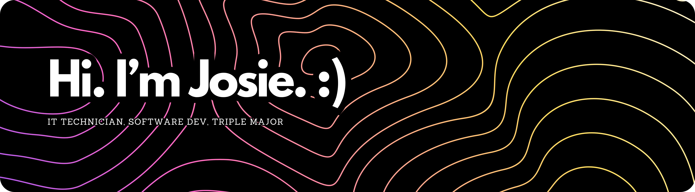

---

### 🌟 About Me
- 📖 Currently studying Software Engineering Technologies, Software Development, and Computer Support/Administration, plus an in-progress certification in Network Administration.
- 🧠 Lifelong learner with a soft spot for **AI**, **automation**, and **attempting to make things pretty**.
- 🔧 Passionate about debugging, clear documentation, and making things just work™ (even if I don't entirely know why).
- 🤓 Will 100% have 6 new project ideas before last week's is finished.

---

### 🛠️ Projects & Shenanigans (in-progress & upcoming)
- 💻 Working on my personal website!
- 🤖 Building my own custom AI home assistant named **Glitch** on a Raspberry Pi
- 🧙‍♀️ Developing an AI-powered D&D DM bot: **L0R3.exe**
- 📺 Designing a faux CRT TV helmet thing that makes you look like a robot w/ cute animated expressions
- 🪞 Trying to figure out something to do with smart mirrors...
- 🧹 Brainstorming ideas for an idle game centered around cleaning robots

---

### 📚 Currently Learning
- 🌐 Web Development w/ **C# & MySQL**
- 🖥️ Low-level system programming in **C**

---

### 🧰 Languages & Tools

